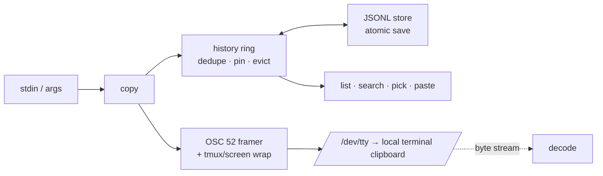

# clipring

[English](README.md) | [中文](README.zh.md) | [日本語](README.ja.md)

[](LICENSE) [](Cargo.toml)  [](CONTRIBUTING.md)

**OSC 52 によるオープンソースのターミナル・クリップボード履歴 — SSH・tmux・screen を越えてキャプチャ、閲覧、再ペースト。**


```bash
git clone https://github.com/JaydenCJ/clipring.git && cargo install --path clipring
```

## なぜ clipring？

クリップボード履歴はどこにでもある — macOS、GNOME、Windows、エディタ — ただし開発者が実際に住んでいる場所、つまり tmux の中の SSH 三段先のシェルを除いて。そこでは「コピー」はペイン境界を避けながらのマウス選択を意味し、「履歴」はコマンドの打ち直しを意味する。OSC 52 は転送問題を解決し（ターミナル自身がコピーするので、どんな SSH 経路でもリモート側の設定は不要）、yank のようなワンショットスクリプトがそれを実証した — しかし彼らはコピーした端から忘れていく。tmux バッファは覚えているが、tmux の中に閉じ込められ、システムクリップボードには届かない。clipring は両者を組み合わせる：`clipring copy` のたびにターミナルのバイトストリーム経由で**ローカル**のクリップボードを設定し、**かつ**一覧・検索・選択・再ペーストできる永続リングに記録する — localhost でも SSH 越しでも完全に同じ動作で、tmux/screen のパススルー封筒も自動処理される。

|  | clipring | osc52.sh / yank | tmux バッファ | CopyQ / GNOME クリップボード |
|---|---|---|---|---|
| リモートシェルからローカルクリップボードへ | はい | はい | `set-clipboard` が必要 | いいえ |
| 永続履歴 | はい（JSONL リング、再起動後も残る） | いいえ | セッション内のみ | はい |
| 閲覧 / 検索 / 選択 | `list`・`search`・`pick` | いいえ | `choose-buffer`（tmux 内限定） | GUI のみ |
| tmux 外でも動く | はい | はい | いいえ | 対象外 |
| tmux + screen パススルー | 自動、両対応 | 手動 / 不完全 | 対象外 | 対象外 |
| ピン留めで淘汰から保護 | はい | いいえ | いいえ | 一部 |
| バイナリ安全な往復 | はい（バイト単位で一致） | テキストのみ | テキストのみ | 実装次第 |
| ランタイム依存 | なし（自己完結の単一バイナリ） | shell + coreutils | tmux | フルデスクトップスタック |

## 機能

- **SSH を越えるコピーがローカル同然** — `anything | clipring copy` がターミナルのバイトストリームに OSC 52 シーケンスを流し、ローカルのターミナルがコピーを実行する。X 転送もリモートデーモンも netcat の小細工も不要。
- **ワンショットのパイプではなく履歴リング** — 各コピーは `~/.local/state/clipring/history.jsonl` に（新しい順で）記録される；`paste 2` は任意エントリをバイト単位で再出力、`pick` は対話的に再コピー、重複は積み上がらず先頭へ昇格する。
- **tmux と screen はそのまま動く** — `$TMUX`/`$TERM` 検出でシーケンスを正しいパススルー封筒（ESC 二重化の tmux DCS、768 バイト以下の screen チャンク）に包む；ネストが変則的なら `--wrap` で上書き。
- **大事なものはピン留め** — ピン留めエントリは容量淘汰と `clear` の対象外になり、毎日使うトンネルコマンドがログ断片五十件に押し流されない。
- **眺めても安全** — `list` のプレビューは制御文字を無害化し（保存されたエスケープシーケンスがターミナルで実行されることは決してない）、バイナリは 16 進スケッチで表示、一方 `paste` はバイト単位の正確さを保つ。
- **逆方向のデコーダも同梱** — `clipring decode` は任意のバイトストリーム（`script` の記録、tmux ペインのダンプ、clipring 自身の出力）から全 OSC 52 シーケンスを抽出・デコードし、封筒も途中で解いていく。
- **サイズ上限に正直** — ターミナルは大きすぎる OSC 52 ペイロードを黙って捨てる；clipring は知らんぷりをせず、エントリを履歴に残した上で明確に知らせる（`--limit`、既定 100 kB の base64）。

## クイックスタート

インストール（Rust 1.75+ が必要）：

```bash
git clone https://github.com/JaydenCJ/clipring.git && cargo install --path clipring
```

コピーする — ローカルでも、SSH 越しでも、tmux 内でも；コマンドは同一：

```bash
printf 'ssh -L 5432:127.0.0.1:5432 deploy@example.test' | clipring copy
clipring copy --trim "kubectl logs -f api-7d4b9c --tail=100"
clipring list
```

出力（tmux 内・SSH 経由の実セッションから採取）：

```text
clipring: copied 46 B -> clipboard via /dev/tty [tmux] (history: 1/50)
clipring: copied 37 B -> clipboard via /dev/tty [tmux] (history: 2/50)
    0   now      37 B  kubectl logs -f api-7d4b9c --tail=100
    1   now      46 B  ssh -L 5432:127.0.0.1:5432 deploy@example.test
```

取り戻す — 対話的に再コピー、あるいは古いエントリをそのままコマンドへパイプ：

```bash
clipring pick          # 番号メニュー -> 選んだものを OSC 52 で再コピー
clipring paste 1 | sh  # エントリ 1、バイト単位で一致、パイプラインへ直行
clipring pin 1         # 淘汰から保護する
clipring search kube   # リングを grep（不一致は終了コード 1、スクリプト向き）
```

```text
    0   now      37 B  kubectl logs -f api-7d4b9c --tail=100
    1   now      46 B  ssh -L 5432:127.0.0.1:5432 deploy@example.test
pick (0-1, q to cancel)> 1
clipring: re-copied entry 1 (46 B) via /dev/tty
```

tmux 内では一度だけパススルーを許可する（`~/.tmux.conf`）：`set -g allow-passthrough on`。正確なバイトシーケンスとターミナル対応表は [docs/osc52.md](docs/osc52.md) を参照。

## コマンド

| コマンド | 効果 |
|---|---|
| `copy [TEXT..]`（`c`） | stdin か TEXT を履歴に保存し OSC 52 でコピー（`--primary`・`--trim`・`--no-emit`・`--no-store`） |
| `paste [N]`（`p`） | エントリ N（既定 0 = 最新）をバイト単位で stdout へ出力 |
| `list`（`ls`） | リングを表示：番号、経過時間、サイズ、ピン印、安全なプレビュー（`--json`・`-n`） |
| `pick` | 番号メニュー；選択を再コピーして先頭へ昇格（`--print` で stdout へ） |
| `search PATTERN` | 大文字小文字を無視して絞り込み；不一致なら終了コード 1 |
| `pin` / `unpin` / `rm` / `clear` | リングを整理；`clear` はピン留めを残し、`--all` は残さない |
| `emit` / `decode` | 双方向の生 OSC 52、履歴には触れない |
| `info` | 状態の場所、エントリ数、検出された封筒モード、上限 |

## 設定

| キー | 既定値 | 効果 |
|---|---|---|
| `CLIPRING_STATE` / `--state` | `~/.local/state/clipring` | 履歴リングの保存場所 |
| `CLIPRING_CAPACITY` / `--capacity` | `50` | 淘汰前に保持する未ピンエントリ数 |
| `CLIPRING_LIMIT` / `--limit` | `100000` | 送出する base64 ペイロードの最大バイト数（0 = 無制限） |
| `CLIPRING_WRAP` / `--wrap` | `auto` | パススルー封筒：`auto`・`none`・`tmux`・`screen` |

## アーキテクチャ



## ロードマップ

- [x] コアツール：tmux/screen パススルー付き OSC 52 送出、ピン留めと容量淘汰を備えた永続・重複排除の履歴リング、ピッカー、検索、デコーダ、サイズ上限ポリシー、アトミックな JSONL ストア
- [ ] `clipring recv`：OSC 52 クエリ応答でターミナルのクリップボードを読み戻す（ターミナルが許す範囲で）
- [ ] `pick` と `search` のオプションのあいまい一致
- [ ] コマンド表から生成するシェル補完（bash/zsh/fish）
- [ ] tmux バッファの変化をリングへミラーする `--watch` モード

全リストは [open issues](https://github.com/JaydenCJ/clipring/issues) を参照。

## コントリビュート

コントリビューション歓迎 — [CONTRIBUTING.md](CONTRIBUTING.md) を参照し、[good first issue](https://github.com/JaydenCJ/clipring/issues?q=is%3Aissue+is%3Aopen+label%3A%22good+first+issue%22) から始めるか、[discussion](https://github.com/JaydenCJ/clipring/discussions) を立ててほしい。

## ライセンス

[MIT](LICENSE)
