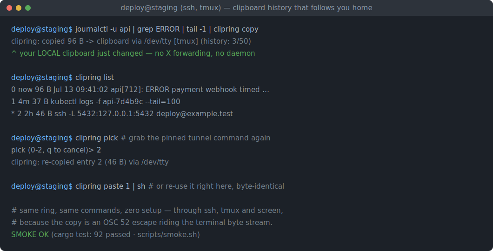
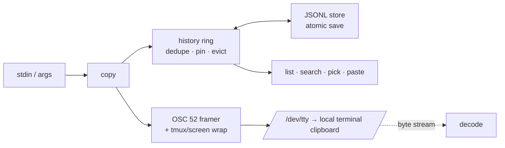

# clipring

[English](README.md) | [中文](README.zh.md) | [日本語](README.ja.md)

[](LICENSE) [](Cargo.toml)  [](CONTRIBUTING.md)

**Open-source terminal clipboard history over OSC 52 — capture, browse, and re-paste across SSH, tmux, and screen.**



```bash
git clone https://github.com/JaydenCJ/clipring.git && cargo install --path clipring
```

## Why clipring?

Clipboard history exists everywhere — macOS, GNOME, Windows, your editor — except the place developers actually live: a shell three SSH hops deep inside tmux. There, "copy" means mouse-selecting through pane borders and history means re-running the command. OSC 52 solves the transport (the terminal itself copies, so it works through any SSH chain with zero remote setup), and one-shot scripts like yank prove it — but they forget every copy immediately. tmux buffers remember, but stay trapped inside tmux and never reach your system clipboard. clipring combines both halves: every `clipring copy` sets your *local* clipboard through the terminal byte stream **and** lands in a persistent ring you can list, search, pick from, and re-paste — identically on localhost and over SSH, with the tmux/screen passthrough envelopes handled for you.

|  | clipring | osc52.sh / yank | tmux buffers | CopyQ / GNOME clipboard |
|---|---|---|---|---|
| Copy from remote shell to local clipboard | yes | yes | with `set-clipboard` | no |
| Persistent history | yes (JSONL ring, survives reboot) | no | session-only | yes |
| Browse / search / pick | `list`, `search`, `pick` | no | `choose-buffer` (inside tmux only) | GUI only |
| Works outside tmux | yes | yes | no | n/a |
| tmux + screen passthrough | automatic, both | manual / partial | n/a | n/a |
| Pin entries against eviction | yes | no | no | some |
| Binary-safe round trip | yes (byte-identical) | text only | text only | varies |
| Runtime dependencies | none (one self-contained binary) | shell + coreutils | tmux | full desktop stack |

## Features

- **Copies that cross SSH like they were local** — `anything | clipring copy` emits an OSC 52 sequence down the terminal byte stream; your local terminal performs the copy. No X forwarding, no remote daemon, no netcat tricks.
- **A history ring, not a one-shot pipe** — every copy is recorded (newest first) in `~/.local/state/clipring/history.jsonl`; `paste 2` re-prints any entry byte-identically, `pick` re-copies it interactively, duplicates promote instead of piling up.
- **tmux and screen just work** — `$TMUX`/`$TERM` detection wraps the sequence in the right passthrough envelope (ESC-doubled tmux DCS, ≤768-byte screen chunks); `--wrap` overrides when nesting gets weird.
- **Pin what matters** — pinned entries are immune to capacity eviction and to `clear`, so the tunnel command you need every day survives fifty log snippets.
- **Safe to look at** — `list` previews are control-neutralized (a stored escape sequence can never execute in your terminal) and binary entries show a hex sketch, while `paste` stays byte-exact.
- **A decoder for the other direction** — `clipring decode` extracts and decodes every OSC 52 set from any byte stream (a `script` recording, a tmux pane dump, clipring's own output), unwrapping envelopes as it goes.
- **Honest size limits** — terminals silently drop oversized OSC 52 payloads; clipring refuses to pretend, keeps the entry in history, and tells you (`--limit`, default 100 kB of base64).

## Quickstart

Install (requires Rust 1.75+):

```bash
git clone https://github.com/JaydenCJ/clipring.git && cargo install --path clipring
```

Copy things — locally, over SSH, inside tmux; the commands are identical:

```bash
printf 'ssh -L 5432:127.0.0.1:5432 deploy@example.test' | clipring copy
clipring copy --trim "kubectl logs -f api-7d4b9c --tail=100"
clipring list
```

Output (captured from a real session inside tmux over SSH):

```text
clipring: copied 46 B -> clipboard via /dev/tty [tmux] (history: 1/50)
clipring: copied 37 B -> clipboard via /dev/tty [tmux] (history: 2/50)
    0   now      37 B  kubectl logs -f api-7d4b9c --tail=100
    1   now      46 B  ssh -L 5432:127.0.0.1:5432 deploy@example.test
```

Get things back — re-copy interactively, or pipe an old entry straight into a command:

```bash
clipring pick          # numbered menu -> re-copies your choice via OSC 52
clipring paste 1 | sh  # entry 1, byte-identical, straight into a pipeline
clipring pin 1         # protect it from eviction
clipring search kube   # grep the ring (exit 1 on no match, script-friendly)
```

```text
    0   now      37 B  kubectl logs -f api-7d4b9c --tail=100
    1   now      46 B  ssh -L 5432:127.0.0.1:5432 deploy@example.test
pick (0-1, q to cancel)> 1
clipring: re-copied entry 1 (46 B) via /dev/tty
```

Inside tmux, allow passthrough once (`~/.tmux.conf`): `set -g allow-passthrough on`. See [docs/osc52.md](docs/osc52.md) for the exact byte sequences and a terminal support table.

## Commands

| Command | Effect |
|---|---|
| `copy [TEXT..]` (`c`) | Store stdin or TEXT in history and copy it via OSC 52 (`--primary`, `--trim`, `--no-emit`, `--no-store`) |
| `paste [N]` (`p`) | Print entry N (default 0 = newest) to stdout, byte-identical |
| `list` (`ls`) | Show the ring: index, age, size, pin marker, safe preview (`--json`, `-n`) |
| `pick` | Numbered menu; re-copies and promotes the choice (`--print` for stdout) |
| `search PATTERN` | Case-insensitive filter; exit 1 when nothing matches |
| `pin` / `unpin` / `rm` / `clear` | Curate the ring; `clear` keeps pinned entries, `--all` doesn't |
| `emit` / `decode` | Raw OSC 52 in both directions, without touching history |
| `info` | State location, entry counts, detected wrap, limits |

## Configuration

| Key | Default | Effect |
|---|---|---|
| `CLIPRING_STATE` / `--state` | `~/.local/state/clipring` | Where the history ring lives |
| `CLIPRING_CAPACITY` / `--capacity` | `50` | Unpinned entries kept before eviction |
| `CLIPRING_LIMIT` / `--limit` | `100000` | Max base64 payload bytes emitted (0 = unlimited) |
| `CLIPRING_WRAP` / `--wrap` | `auto` | Passthrough envelope: `auto`, `none`, `tmux`, `screen` |

## Architecture



## Roadmap

- [x] Core tool: OSC 52 emission with tmux/screen passthrough, persistent dedup-ing history ring with pinning and capacity eviction, picker, search, decoder, size-limit policy, atomic JSONL store
- [ ] `clipring recv`: read the terminal's clipboard back via the OSC 52 query response (where terminals allow it)
- [ ] Optional fuzzy matching in `pick` and `search`
- [ ] Shell completions (bash/zsh/fish) generated from the command table
- [ ] A `--watch` mode that mirrors every tmux buffer change into the ring

See the [open issues](https://github.com/JaydenCJ/clipring/issues) for the full list.

## Contributing

Contributions are welcome — see [CONTRIBUTING.md](CONTRIBUTING.md), start with a [good first issue](https://github.com/JaydenCJ/clipring/issues?q=is%3Aissue+is%3Aopen+label%3A%22good+first+issue%22) or open a [discussion](https://github.com/JaydenCJ/clipring/discussions).

## License

[MIT](LICENSE)
