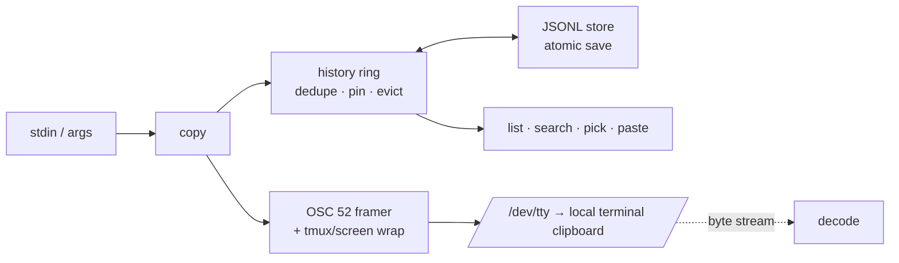

# clipring

[English](README.md) | [中文](README.zh.md) | [日本語](README.ja.md)

[](LICENSE) [](Cargo.toml)  [](CONTRIBUTING.md)

**基于 OSC 52 的开源终端剪贴板历史——跨 SSH、tmux、screen 捕获、浏览、重新粘贴。**


```bash
git clone https://github.com/JaydenCJ/clipring.git && cargo install --path clipring
```

## 为什么选 clipring？

剪贴板历史无处不在——macOS、GNOME、Windows、你的编辑器——唯独缺席开发者真正常驻的地方：tmux 里三层 SSH 深处的 shell。在那里，"复制"意味着鼠标框选还得躲开分屏边框，"历史"意味着重新跑一遍命令。OSC 52 解决了传输问题（由终端自己执行复制，因此穿过任意 SSH 链路都无需远端配置），yank 之类的一次性脚本也证明了这一点——但它们复制完就忘。tmux buffer 记得住，却被困在 tmux 里，永远到不了系统剪贴板。clipring 把两半合到一起：每次 `clipring copy` 都通过终端字节流设置你**本地**的剪贴板，**并且**记入一个可列出、可搜索、可挑选、可重新粘贴的持久环——在 localhost 和 SSH 上行为完全一致，tmux/screen 的透传封包也替你处理好了。

|  | clipring | osc52.sh / yank | tmux buffer | CopyQ / GNOME 剪贴板 |
|---|---|---|---|---|
| 从远程 shell 复制到本地剪贴板 | 是 | 是 | 需 `set-clipboard` | 否 |
| 持久历史 | 是（JSONL 环，重启不丢） | 否 | 仅会话内 | 是 |
| 浏览 / 搜索 / 挑选 | `list`、`search`、`pick` | 否 | `choose-buffer`（仅限 tmux 内） | 仅 GUI |
| tmux 之外可用 | 是 | 是 | 否 | 不适用 |
| tmux + screen 透传 | 自动，两者皆可 | 手动 / 不完整 | 不适用 | 不适用 |
| 置顶条目防淘汰 | 是 | 否 | 否 | 部分 |
| 二进制安全往返 | 是（逐字节一致） | 仅文本 | 仅文本 | 视实现而定 |
| 运行时依赖 | 无（自足的单一二进制） | shell + coreutils | tmux | 完整桌面栈 |

## 功能

- **跨 SSH 的复制如同本地** —— `anything | clipring copy` 沿终端字节流发出 OSC 52 序列，由你本地的终端执行复制。不需要 X 转发、远端守护进程或 netcat 花招。
- **是历史环，不是一次性管道** —— 每次复制都记录（最新在前）到 `~/.local/state/clipring/history.jsonl`；`paste 2` 逐字节重印任意条目，`pick` 交互式重新复制，重复内容前移而不是堆积。
- **tmux 和 screen 开箱即用** —— 通过 `$TMUX`/`$TERM` 检测把序列包进正确的透传封包（ESC 加倍的 tmux DCS、≤768 字节的 screen 分块）；嵌套复杂时用 `--wrap` 覆盖。
- **置顶重要的东西** —— 置顶条目免疫容量淘汰和 `clear`，你每天要用的隧道命令不会被五十条日志片段冲掉。
- **看着放心** —— `list` 预览会中和控制字符（存入的转义序列绝不会在你的终端里执行），二进制条目显示十六进制速写，而 `paste` 保持逐字节精确。
- **反方向也有解码器** —— `clipring decode` 从任意字节流（`script` 录像、tmux 面板转储、clipring 自己的输出）提取并解码每个 OSC 52 序列，途中自动解开封包。
- **对大小限制诚实** —— 终端会悄悄丢弃超大的 OSC 52 载荷；clipring 拒绝装作没事，把条目留在历史里并明确告诉你（`--limit`，默认 100 kB base64）。

## 快速上手

安装（需要 Rust 1.75+）：

```bash
git clone https://github.com/JaydenCJ/clipring.git && cargo install --path clipring
```

复制东西——本地、SSH 上、tmux 里；命令完全相同：

```bash
printf 'ssh -L 5432:127.0.0.1:5432 deploy@example.test' | clipring copy
clipring copy --trim "kubectl logs -f api-7d4b9c --tail=100"
clipring list
```

输出（截取自 tmux 内经 SSH 的真实会话）：

```text
clipring: copied 46 B -> clipboard via /dev/tty [tmux] (history: 1/50)
clipring: copied 37 B -> clipboard via /dev/tty [tmux] (history: 2/50)
    0   now      37 B  kubectl logs -f api-7d4b9c --tail=100
    1   now      46 B  ssh -L 5432:127.0.0.1:5432 deploy@example.test
```

取回来——交互式重新复制，或把旧条目直接管道进命令：

```bash
clipring pick          # 编号菜单 -> 经 OSC 52 重新复制所选条目
clipring paste 1 | sh  # 条目 1，逐字节一致，直接进管道
clipring pin 1         # 保护它不被淘汰
clipring search kube   # 在环里 grep（无匹配退出码 1，方便脚本）
```

```text
    0   now      37 B  kubectl logs -f api-7d4b9c --tail=100
    1   now      46 B  ssh -L 5432:127.0.0.1:5432 deploy@example.test
pick (0-1, q to cancel)> 1
clipring: re-copied entry 1 (46 B) via /dev/tty
```

在 tmux 里只需允许一次透传（`~/.tmux.conf`）：`set -g allow-passthrough on`。精确的字节序列和终端支持表见 [docs/osc52.md](docs/osc52.md)。

## 命令

| 命令 | 效果 |
|---|---|
| `copy [TEXT..]`（`c`） | 把 stdin 或 TEXT 存入历史并经 OSC 52 复制（`--primary`、`--trim`、`--no-emit`、`--no-store`） |
| `paste [N]`（`p`） | 把条目 N（默认 0 = 最新）逐字节打印到 stdout |
| `list`（`ls`） | 显示环：序号、时间、大小、置顶标记、安全预览（`--json`、`-n`） |
| `pick` | 编号菜单；重新复制并前移所选条目（`--print` 输出到 stdout） |
| `search PATTERN` | 大小写不敏感过滤；无匹配时退出码 1 |
| `pin` / `unpin` / `rm` / `clear` | 整理环；`clear` 保留置顶条目，`--all` 则不保留 |
| `emit` / `decode` | 双向的原始 OSC 52，不触碰历史 |
| `info` | 状态位置、条目计数、检测到的封包模式、限制 |

## 配置

| 键 | 默认值 | 效果 |
|---|---|---|
| `CLIPRING_STATE` / `--state` | `~/.local/state/clipring` | 历史环存放位置 |
| `CLIPRING_CAPACITY` / `--capacity` | `50` | 淘汰前保留的未置顶条目数 |
| `CLIPRING_LIMIT` / `--limit` | `100000` | 允许发出的最大 base64 载荷字节数（0 = 不限） |
| `CLIPRING_WRAP` / `--wrap` | `auto` | 透传封包：`auto`、`none`、`tmux`、`screen` |

## 架构



## 路线图

- [x] 核心工具：带 tmux/screen 透传的 OSC 52 发送、带置顶和容量淘汰的持久去重历史环、挑选器、搜索、解码器、大小限制策略、原子 JSONL 存储
- [ ] `clipring recv`：通过 OSC 52 查询响应读回终端剪贴板（在终端允许的范围内）
- [ ] `pick` 与 `search` 的可选模糊匹配
- [ ] 从命令表生成 shell 补全（bash/zsh/fish）
- [ ] `--watch` 模式，把每次 tmux buffer 变化镜像进环

完整列表见 [open issues](https://github.com/JaydenCJ/clipring/issues)。

## 参与贡献

欢迎贡献——见 [CONTRIBUTING.md](CONTRIBUTING.md)，可以从 [good first issue](https://github.com/JaydenCJ/clipring/issues?q=is%3Aissue+is%3Aopen+label%3A%22good+first+issue%22) 入手，或发起一个 [discussion](https://github.com/JaydenCJ/clipring/discussions)。

## 许可证

[MIT](LICENSE)
